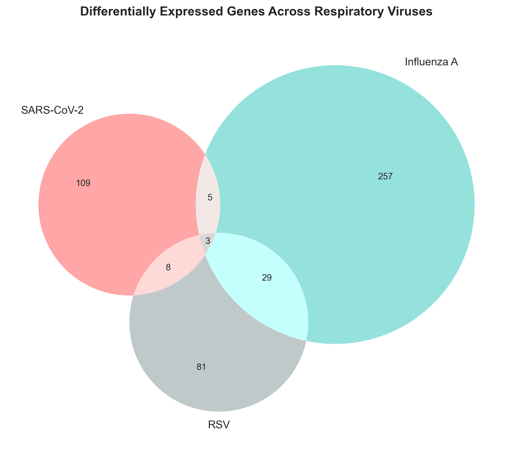
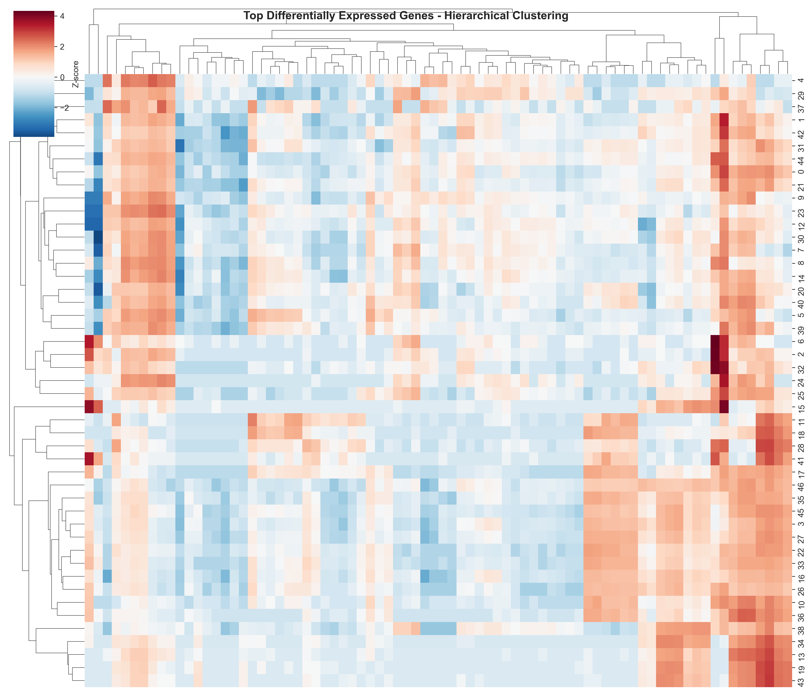
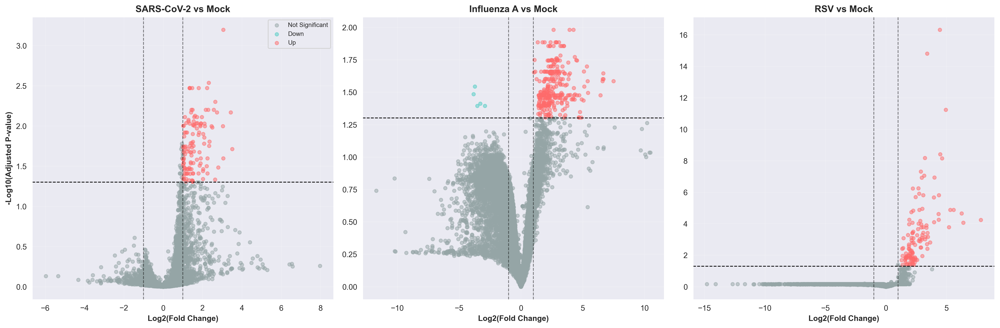
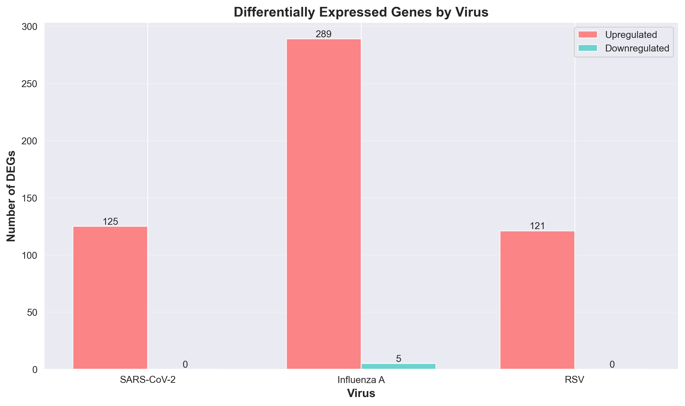
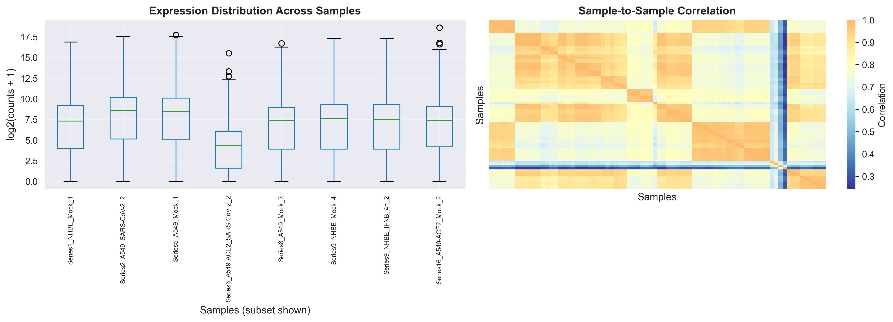

# Multi-Virus Respiratory Infection Transcriptomic Comparison

## 🎯 Research Question

**How do different respiratory viruses (SARS-CoV-2, Influenza A, and RSV) differ in their transcriptomic response in human airway epithelial cells?**

### Hypothesis
Each virus will trigger:
1. **Common immune responses** - shared antiviral pathways (interferon response, inflammation)
2. **Virus-specific gene signatures** - unique molecular patterns that distinguish each pathogen

### Scientific Rationale
Understanding shared vs unique transcriptomic responses can:
- Guide development of broad-spectrum antiviral therapies (targeting common pathways)
- Enable virus-specific diagnostics (using unique gene signatures)
- Reveal why different viruses cause varying disease severity

## 📊 Experimental Design

**Dataset:** GSE147507 (NCBI Gene Expression Omnibus)  
**Platform:** RNA-seq (Illumina)  
**Cell Type:** Human airway epithelial cells  
**Infection Time:** 24 hours post-infection

**Comparison Groups:**
- SARS-CoV-2 infected vs Mock controls
- Influenza A (IAV) infected vs Mock controls  
- Respiratory Syncytial Virus (RSV) infected vs Mock controls

**Sample Groups:**
- SARS-CoV-2: 21 samples
- Influenza A (IAV): 10 samples
- RSV: 5 samples
- Mock controls: 29 samples

**Analysis Approach:**
1. Differential expression analysis for each virus
2. Identification of overlapping vs unique differentially expressed genes (DEGs)
3. Comparative visualization and biological interpretation

## 🔬 Key Findings







**Major Results:**
- 3 genes shared across all three viruses (common immune response)
- 109 genes unique to SARS-CoV-2
- 257 genes unique to Influenza A
- 81 genes unique to RSV

## 🛠️ Methods

**Differential Expression Analysis:**
- Independent t-tests (virus vs mock)
- FDR correction (Benjamini-Hochberg)
- Thresholds: |Log2FC| > 1, adj. p < 0.05

**Comparative Analysis:**
- Venn diagrams (gene set overlaps)
- Hierarchical clustering (gene expression patterns)
- Volcano plots (effect size visualization)

**Tools:** Python, pandas, scipy, seaborn, matplotlib

## 📁 Project Structure
```
├── data/                    # Expression data
├── figures/                 # Visualizations
│   ├── venn_diagram.png
│   ├── clustered_heatmap.png
│   ├── comparative_volcanoes.png
│   └── deg_counts_comparison.png
├── results/                 # DE results per virus
└── multi_virus_comparison.ipynb
```

## 🚀 Skills Demonstrated

✓ Multi-group comparative analysis  
✓ Set operations & Venn diagrams  
✓ Hierarchical clustering  
✓ Advanced data visualization  
✓ Biological interpretation

---

**Part of my #Bioinformatics learning journey** 🧬
Up next, Geographic Comparison of COVID!
